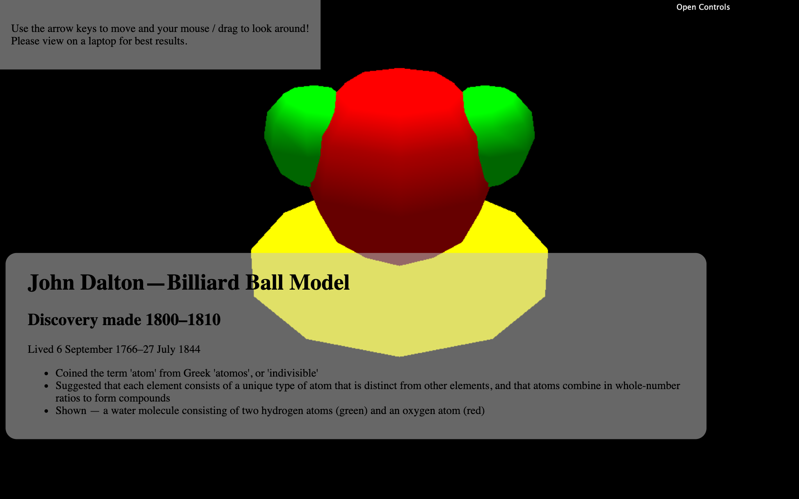
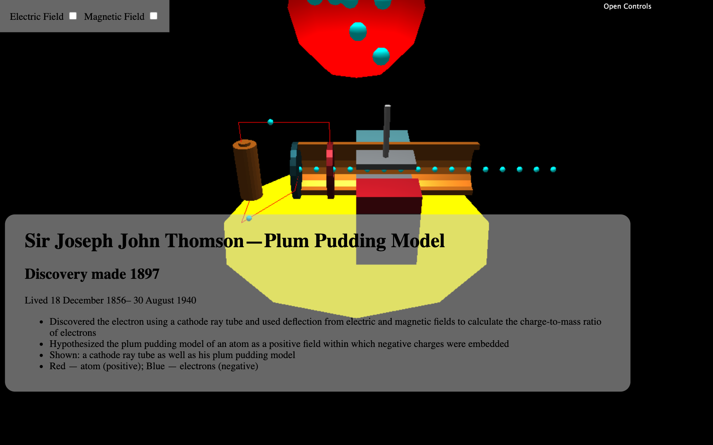
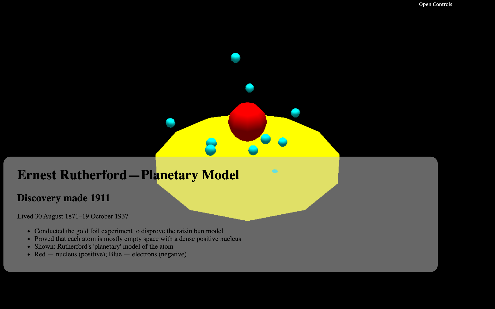
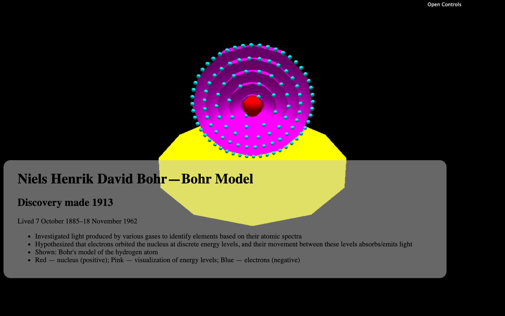
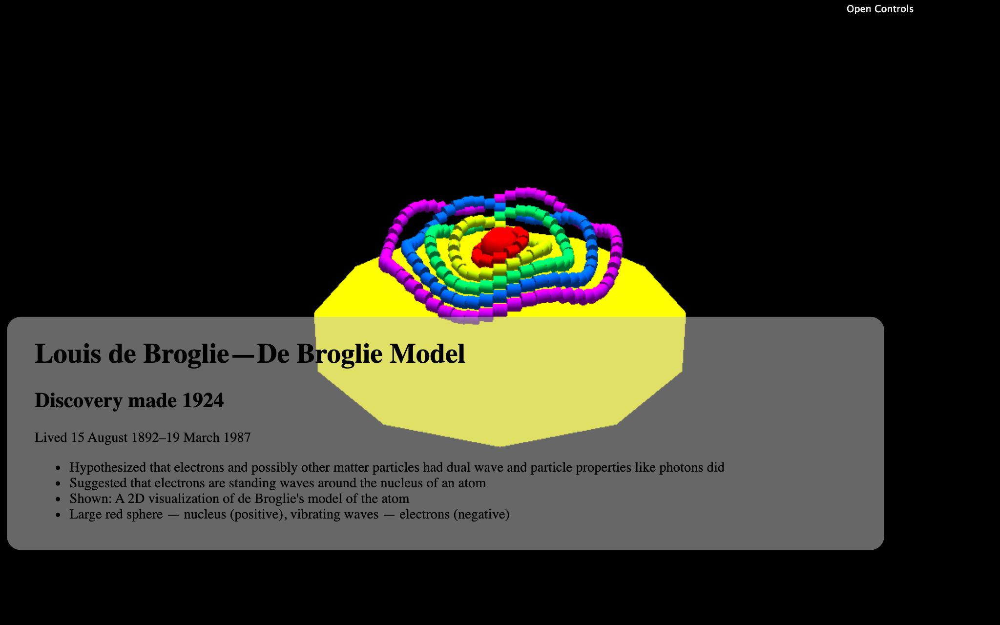
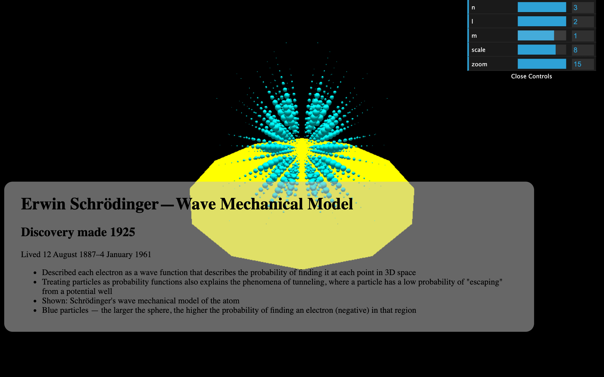

# Atomic Models Project

Built by Alexander Cai 2021-05-28 for a Physics IB Higher Level project on the history of atomic models.

Built with:

- Vanilla [JavaScript](https://developer.mozilla.org/en-US/docs/Web/javascript)
- Vanilla [Webpack](https://webpack.js.org/)
- [tween.js](https://github.com/tweenjs/tween.js/) for transitions
- [three.js](https://threejs.org/), which is built on [WebGL](https://developer.mozilla.org/en-US/docs/Web/API/WebGL_API), for 3D visualization
    - See the documentation for [GLTFLoader](https://threejs.org/docs/index.html?q=gltf#examples/en/loaders/GLTFLoader), [PerspectiveCamera](https://threejs.org/docs/index.html?q=perspect#api/en/cameras/PerspectiveCamera), and [OrbitControls](https://threejs.org/docs/index.html?q=orbit#examples/en/controls/OrbitControls) for more info
- [Tinkercad](https://www.tinkercad.com/) for building 3D models

Equations for the electron models are taken from class notes.

## Code overview

Each of the seven files in `/src/slides` describes a different atomic model. Each one has a default export that is a function that constructs and returns a three.js `Group` that visualizes that atomic model.

These are imported in `/src/slides/index.js`, which also contains the text data for all of the models and handles the transitions between slides.

`/src/index.js` and `/src/scene.js` initialize the three.js scene, camera, and the camera controls. `/src/util.js` contains some math utilities and also the functions for describing the electron probability densities in the Schroedinger model.

Note that the current version of the `develop` branch will build fine locally but not when deployed to GitHub pages because of idiosyncrasies with file paths that I couldn't be bothered to fix.
